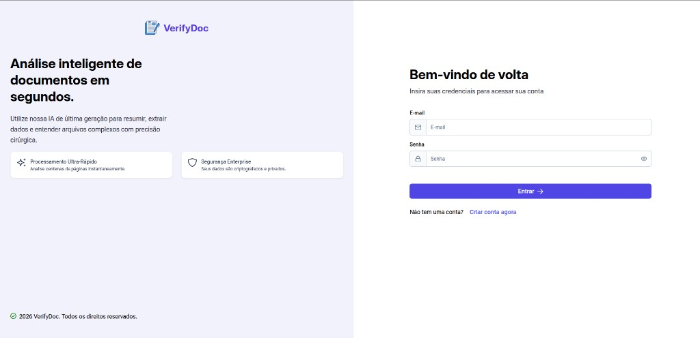
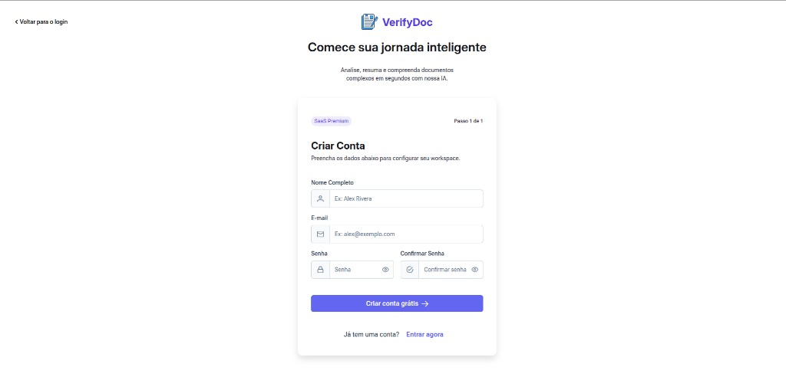
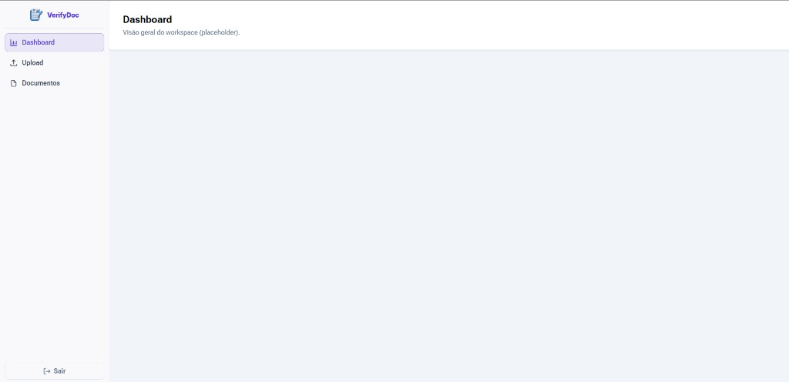
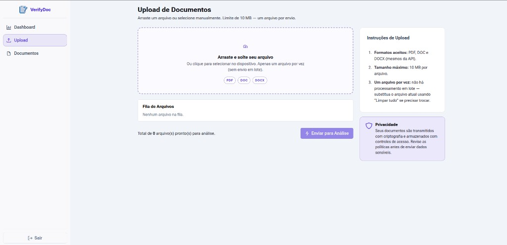
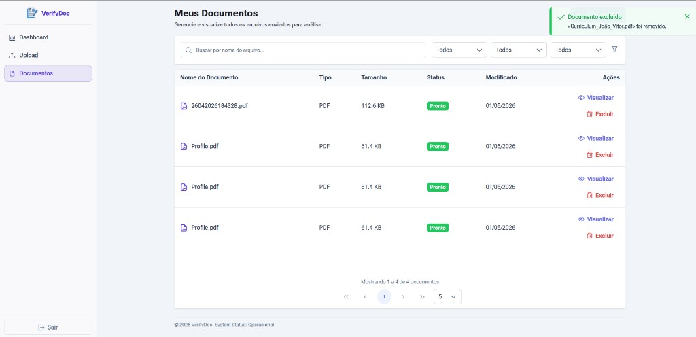

# Document Analyzer — Frontend (VerifyDoc)

SPA em **Angular 21** para o produto **Document Analyzer** (VerifyDoc): login e registo de utilizadores, upload de documentos (PDF, DOC, DOCX), listagem e detalhe com pré-visualização de PDF, resumo em **Markdown** renderizado na UI, confirmações e notificações com **PrimeNG** (ConfirmDialog + Toast). Comunicação com a API REST via **HttpClient**, **JWT** no interceptor (exceto login e `POST /users`) e tema **PrimeNG / Lara (indigo)** com **Roboto Flex**.

Para a stack e execução do **backend**, consulte o README da API: [`../api/README.md`](../api/README.md).

## Pré-visualização da interface

Algumas telas da aplicação em execução (tema claro, PrimeNG).

### Login



### Registo



### Dashboard



### Upload



### Documentos



## Requisitos

| Ambiente | Versão |
|----------|--------|
| Node.js | compatível com Angular 21 (recomendado **20+**) |
| npm | **11.x** (definido em `package.json` como `packageManager`) |

## Configuração local

1. **URL da API** — definida em `src/environments/environment.ts` (produção) e `src/environments/environment.development.ts` (desenvolvimento; o `angular.json` substitui o ficheiro em `ng serve` / build `development`).

   O valor padrão é:

   ```ts
   baseUrl: "http://localhost:8080/api/v1"
   ```

   Ajuste se a API correr noutro host/porta.

2. **CORS** — a API lê a variável **`CORS_ALLOWED_ORIGINS`** (lista separada por vírgulas; ver README da API). Útil quando o front e a API têm origens diferentes (ex.: `ng serve` + API em `8080`).

3. **Instalação de dependências** (na pasta `verifydoc-front`):

   ```bash
   npm install
   ```

## Como rodar em desenvolvimento

Na raiz deste projeto (`verifydoc-front`):

```bash
npm start
```

Equivalente a `ng serve` com a configuração **development** (substituição de `environment.ts` por `environment.development.ts`, source maps, etc.).

Abra o browser em **http://localhost:4200/**. A aplicação recarrega ao alterar o código.

Outras variantes úteis:

```bash
npx ng serve --configuration=development
npx ng serve --port 4300
```

## Build

| Comando | Efeito |
|---------|--------|
| `npm run build` | Build **production** (padrão do `angular.json`; atenção aos *budgets* de tamanho do bundle) |
| `npm run watch` | Build **development** em modo watch |
| `npx ng build --configuration=docker` | Build para imagem Docker (`environment.docker.ts`: `baseUrl` relativo `/api/v1` + Nginx faz *proxy* para a API) |

Saída típica: pasta `dist/verifydoc-front/`.

## Docker (stack com a API)

O **`docker-compose.yml`** da pasta `api/` inclui o serviço **`front`**, que constrói esta pasta (`../verifydoc-front`) e expõe a SPA na porta **4200**.

1. Na pasta `api/`, siga o README da API (`cp .env.example .env`, preencha `JWT_SECRET` e `GEMINI_API_KEY`, etc.).
2. Execute `docker compose up --build` na pasta `api/`.
3. Abra **http://localhost:4200** — o Nginx serve o Angular e encaminha `/api/*` para o contentor da API (sem configurar `baseUrl` absoluto no browser).

Para construir só a imagem do front (a partir desta pasta):

```bash
docker build -t verifydoc-front .
```

Para servir o build de produção localmente (exemplo):

```bash
npx ng build --configuration=production
npx http-server dist/verifydoc-front/browser -p 4200
```

(Ajuste o subdiretório `browser` conforme a saída do `@angular/build:application`.)

## Funcionalidades principais (visão técnica)

| Área | Detalhe |
|------|---------|
| Autenticação | `AuthenticationService` — `POST .../authentication/login`, token em `localStorage` |
| Registo | `UserService` — `POST .../users` |
| Documentos | `DocumentsService` — listagem, detalhe, upload multipart, download/conteúdo blob, exclusão |
| HTTP | `authInterceptor` — não envia JWT em login e registo público |
| UI global | `ConfirmationService` + `MessageService`; `<p-confirmDialog />` e `<p-toast />` no `AppComponent` |
| Markdown | Pipe `MarkdownPipe` (`marked` + `DOMPurify`) no resumo do documento |

## Estrutura útil do repositório (frontend)

| Caminho | Função |
|---------|--------|
| `src/app/app.config.ts` | Router, HttpClient + interceptor, PrimeNG, serviços de confirmação/mensagem |
| `src/app/app.component.html` | `router-outlet`, ConfirmDialog, Toast |
| `src/app/interceptors/auth.interceptor.ts` | JWT e rotas públicas |
| `src/app/services/` | API: `Authentication.service`, `User.service`, `documents.service` |
| `src/app/pages/` | Rotas lazy: login, registo, home (dashboard, upload, documentos) |
| `src/app/pipes/markdown.pipe.ts` | Resumo Markdown → HTML seguro |
| `src/environments/` | `baseUrl` da API (`environment.ts`, `environment.development.ts`, `environment.docker.ts`) |
| `Dockerfile`, `nginx.conf` | Imagem de produção (Nginx + *proxy* `/api`) |
| `docs/screenshots/` | Capturas para documentação (README) |

## Ferramentas Angular CLI

Projeto gerado com [Angular CLI](https://github.com/angular/angular-cli) **21.0.5** (`package.json` / dependências de desenvolvimento).

### Servidor de desenvolvimento

```bash
npx ng serve
```

Abre em **http://localhost:4200/** e recarrega ao guardar alterações (equivalente prático a `npm start` com a configuração definida no `angular.json`).

### Geração de código

```bash
npx ng generate component nome-do-componente
npx ng generate --help
```

Lista schematics (componentes, diretivas, pipes, etc.).

### Testes

Testes unitários (runner **Vitest** configurado no projeto):

```bash
npx ng test
```

Testes ponta a ponta (o CLI não inclui framework e2e por omissão):

```bash
npx ng e2e
```

### Documentação oficial

- [Angular CLI — visão geral e comandos](https://angular.dev/tools/cli)
